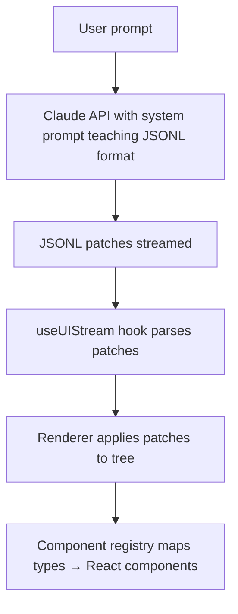
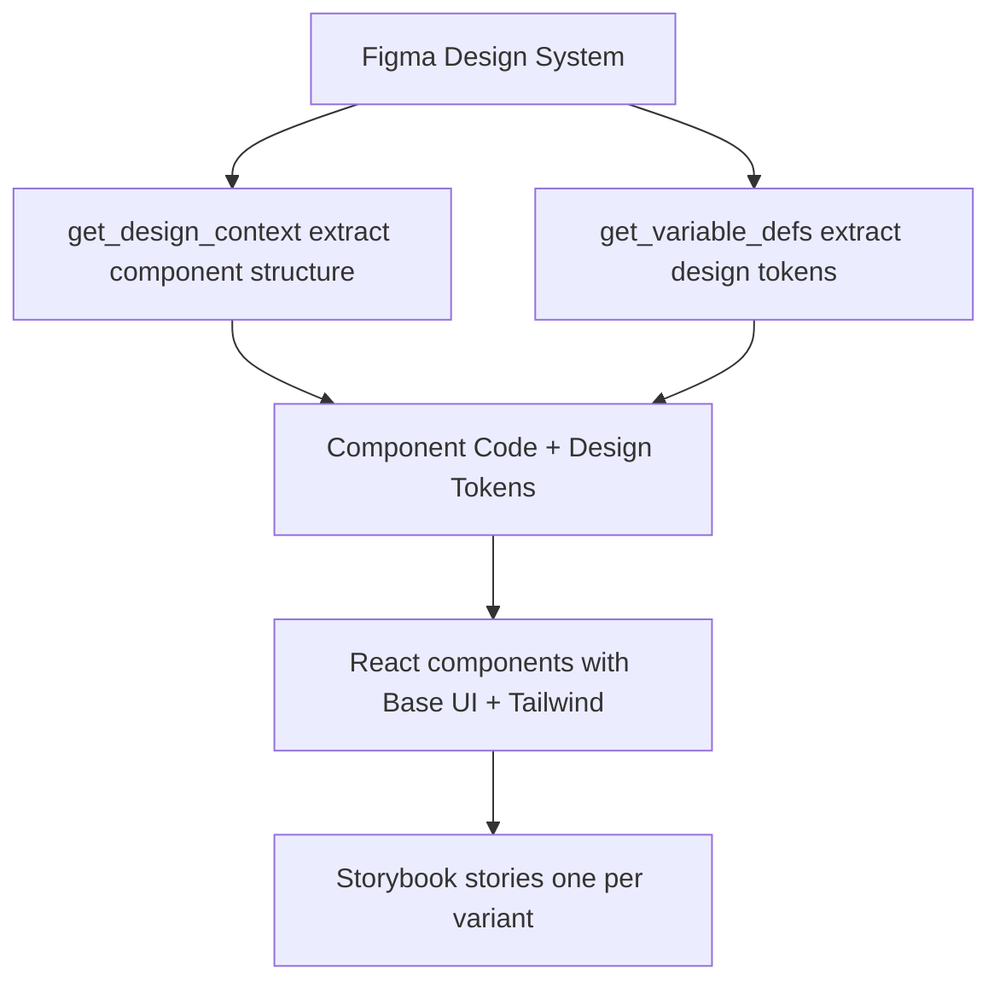

You give Claude the same prompt twice. You get two completely different UIs.

This isn't a bug—it's the nature of LLMs. Non-determinism is baked into how these models work. Same input, different output. Every time. For code generation, this creates a predictability problem: you can't trust what you'll get. One run generates clean component code. The next? A completely different structure with different naming, different patterns, maybe even a different framework approach.

If you're building tools that use LLMs to generate UIs, you've probably felt this pain. You craft the perfect prompt. It works beautifully. You demo it. Then you run it again for a customer and it produces something entirely different. Not wrong, necessarily—just different. And different is the enemy of predictability.

The solution isn't better prompts. It's constraints.

## Constraints Enable Predictability

Limited choices → predictable outputs. This is true for design systems, code architecture, and—crucially—AI-generated UIs. Instead of letting the LLM choose from infinite possibilities, we give it a small, well-defined set of options.

I presented three techniques at FE.OPO #9 for building predictable AI UIs:

1. **Structured Output (json-render)**: AI → JSON → UI pipeline with component catalog as contract
2. **Visual Feedback Loops (agent-browser)**: Generate → Validate → Iterate pattern with natural language feedback
3. **Design System Contracts (Figma MCP)**: Extract design truth directly from Figma, generate code + stories

Each adds different constraints to tame LLM unpredictability. Let's dig into how they work.

## Technique #1: json-render (Structured Output Format)

**The problem**: Free-form code generation leads to inconsistent output. Ask Claude to "build a login form" and you'll get React one time, Vue another, different component structures each run, varying class names, inconsistent patterns.

**The solution**: Don't generate code. Generate JSON.

json-render is a library that implements this pattern: AI → JSONL → UI. Instead of asking the LLM to output React/Vue/whatever directly, you teach it to output JSON Lines patches describing the UI structure. A separate renderer applies those patches and maps them to your component library.

Here's the architecture:



The key constraint is the **component catalog**. You define available components upfront with Zod schemas:

```typescript
export const catalog = createCatalog({
  components: {
    Card: {
      props: z.object({
        title: z.string(),
        description: z.string().nullable(),
      }),
      hasChildren: true,
    },
    Button: {
      props: z.object({
        label: z.string(),
        action: z.string(),
        params: z.record(z.string(), z.any()).optional(),
        variant: z.enum(["default", "outline", "ghost"]).optional(),
        size: z.enum(["default", "sm", "lg"]).optional(),
      }),
    },
    Text: {
      props: z.object({
        content: z.string(),
      }),
    },
  },
  actions: {
    submit: {
      params: z.object({ formId: z.string() }),
    },
    navigate: {
      params: z.object({ url: z.string() }),
    },
  },
});
```

This catalog serves two purposes:

1. Generates the system prompt teaching Claude the JSONL format
2. Validates runtime props via `@json-render/core`

The system prompt becomes your contract:

```typescript
const SYSTEM_PROMPT = `You are a UI generator that outputs JSONL (JSON Lines) patches.

AVAILABLE COMPONENTS:
Card, Button, Text

COMPONENT DETAILS:
- Card: { title: string, description?: string | null } - Container with title, can have children
- Button: { label: string, action: string, params?: object, variant?: "default" | "outline" | "ghost", size?: "default" | "sm" | "lg" } - Clickable button that triggers an action
- Text: { content: string } - Text paragraph

OUTPUT FORMAT:
Output JSONL where each line is a patch operation. Use a FLAT key-based structure:

OPERATIONS:
- {"op":"set","path":"/root","value":"main-card"} - Set the root element key
- {"op":"add","path":"/elements/main-card","value":{...}} - Add an element by unique key

ELEMENT STRUCTURE:
{
  "key": "unique-key",
  "type": "ComponentType",
  "props": { ... },
  "children": ["child-key-1", "child-key-2"]  // Array of child element keys (only for Card)
}

RULES:
1. First set /root to the root element's key
2. Add each element with a unique key using /elements/{key}
3. Parent elements list child keys in their "children" array
4. Stream elements progressively - parent first, then children
5. Each element must have: key, type, props
6. Children array contains STRING KEYS, not nested objects
7. Only Card can have children

Generate JSONL patches now:`;
```

Notice the constraints:

- Only 3 components (Card, Button, Text)
- Flat key-based structure (no nesting)
- Only Card supports children
- Children are string keys, not objects
- Specific operations (set, add)

When you prompt "Create a welcome card with a button," Claude generates:

```jsonl
{"op":"set","path":"/root","value":"welcome-card"}
{"op":"add","path":"/elements/welcome-card","value":{"key":"welcome-card","type":"Card","props":{"title":"Welcome","description":"Thanks for trying json-render"},"children":["greeting-text","get-started-btn"]}}
{"op":"add","path":"/elements/greeting-text","value":{"key":"greeting-text","type":"Text","props":{"content":"This demo shows how AI can generate predictable UIs using structured output formats."}}}
{"op":"add","path":"/elements/get-started-btn","value":{"key":"get-started-btn","type":"Button","props":{"label":"Get Started","action":"navigate","params":{"url":"/home"},"variant":"default"}}}
```

These patches stream to the frontend. The `useUIStream` hook parses them. The `Renderer` component applies them to a tree structure. Finally, the component registry maps types to React implementations:

```typescript
export const registry: ComponentRegistry = {
  Card: ({ element, children }) => (
    <article className="p-4 border-2 border-gray-500 rounded-md max-w-xs shadow bg-gray-800 text-gray-100">
      <header>
        <h2 className="font-bold text-xl">{element.props.title}</h2>
        {element.props.description && (
          <p className="text-gray-400">{element.props.description}</p>
        )}
      </header>
      <div className="space-y-4 pt-8">{children}</div>
    </article>
  ),
  Button,
  Text: ({ element }) => <p>{element.props.content}</p>,
};
```

**Why this matters**: The LLM can't deviate. It knows exactly 3 components. It knows exactly what props they accept. It knows the exact format for patches. Limited choices → predictable outputs.

**When to use json-render**:

- - You have a predefined component library
- - You need streaming UI generation
- - Visual complexity is limited (simple cards, forms, lists)
- - You want runtime validation of generated output
- - You need full design freedom
- - You're generating complex layouts with deep nesting
- - Your component library changes frequently

The catalog becomes your design contract. Change it, regenerate the system prompt, done. Predictability through constraints.

## Technique #2: Feedback Loops (Visual Validation)

**The problem**: LLMs can reason about code but can't verify visual output without rendering.

They understand CSS concepts ("flexbox centers items," "z-index controls stacking"). They know layout principles ("hero section at top," "footer at bottom"). But they can't predict actual browser rendering. Edge cases, browser quirks, visual bugs—invisible to the model.

You may have experienced this:

- Prompt: "Center the login form"
- Code looks correct
- Renders off-center due to parent container constraints
- LLM had no way to know

**The solution**: Generate → Validate → Iterate.

Build a feedback loop where the LLM generates code, you (or a tool) validate the rendered output, then feed results back for iteration. The constraint here is forcing validation before considering work "done."

Two tools enable this: **agent-browser** (natural language) and **Playwright MCP** (screenshots). Different tradeoffs.

Here's a login form I built for the demo:

```typescript
// examples/feedback-loop-demo/app/page.tsx
export default function Page() {
  return (
    <main className="flex min-h-screen items-center justify-center p-8">
      <div className="w-full max-w-md">
        <div className="bg-white rounded-lg shadow-lg p-8">
          <h1 className="text-2xl font-bold text-gray-900 mb-2">
            Welcome back
          </h1>
          <p className="text-gray-600 mb-6">
            Sign in to your account to continue
          </p>

          <form onSubmit={handleSubmit} className="space-y-4">
            <div>
              <label htmlFor="email" className="block text-sm font-medium text-gray-700 mb-1">
                Email
              </label>
              <input
                id="email"
                type="email"
                required
                className="w-full px-3 py-2 border border-gray-300 rounded-md focus:outline-none focus:ring-2 focus:ring-blue-500"
              />
            </div>
            {/* password, checkbox, button... */}
          </form>
        </div>
      </div>
    </main>
  );
}
```

To validate with **agent-browser**:

```bash
# Navigate and get snapshot
Navigate to http://localhost:3001 and validate the login form layout.
Check if email input, password input, and submit button are all visible
and properly aligned.
```

agent-browser returns natural language:

```
* Page loaded successfully
* Login form card visible at center
* Email input: visible, properly labeled, placeholder present
* Password input: visible, properly labeled, placeholder present
* Submit button: visible, blue background, prominent
* Visual hierarchy: excellent (title → inputs → button → footer)
* Accessibility: labels properly associated with inputs
! Minor: "Forgot password" link small, could be more prominent

Overall: Form displays correctly with good UX
```

This output:

- Validates all key elements
- Identifies improvement opportunity
- Uses ~500 bytes vs ~50KB for screenshots
- Enables 100+ iterations within typical context window

Compare to **Playwright MCP**:

```typescript
// Would require:
mcp__playwright__browser_navigate({ url: "http://localhost:3001" });
mcp__playwright__browser_snapshot({ filename: "login-form.md" });
mcp__playwright__browser_take_screenshot({ filename: "login-form.png" });
```

Returns full page snapshot (markdown + accessibility tree) plus base64 PNG screenshot. ~50KB+ added to context window per screenshot.

**Context budget comparison:**

| Aspect          | agent-browser       | Playwright MCP           |
| --------------- | ------------------- | ------------------------ |
| Output format   | Natural language    | Markdown + base64 images |
| Context impact  | Low (~1KB)          | High (~50KB+)            |
| Use case        | Quick visual checks | Deep inspection          |
| Iteration speed | Fast (text-based)   | Slower (image-heavy)     |
| Precision       | Semantic validation | Pixel-perfect validation |

**When to use agent-browser**:

- - Validating layout/positioning
- - Checking element visibility
- - Testing interaction states (hover, focus)
- - Iterating rapidly on visual design
- - Context window preservation matters (agentic workflows)

**When to use Playwright MCP**:

- - Pixel-perfect comparison needed
- - Screenshot documentation required
- - Complex multi-step flows
- - Full browser automation needed
- - Visual regression testing

The feedback loop workflow:

1. Generate UI code
2. Render in browser (localhost)
3. Validate with agent-browser or Playwright
4. Read feedback (natural language or screenshot)
5. Identify issues
6. Fix code
7. Re-validate
8. Repeat until validation passes

For agentic workflows where Claude is autonomously iterating on designs, agent-browser preserves context budget for actual code changes instead of bloating it with images.

## Technique #3: Figma MCP (Design System as Contract)

**The problem**: Traditional design handoff loses fidelity.

Designer creates mockups → Dev interprets visuals → Implementation drifts from design. Colors slightly off. Spacing inconsistent. Typography mismatched. The gap between "what designer intended" and "what developer built" is where quality dies.

**The solution**: Extract design truth directly from Figma, use it as contract.

Figma MCP (Model Context Protocol) lets Claude read Figma files programmatically. Extract components, design tokens, variants—everything. Generate code that matches design exactly. No interpretation gap.

Here's the workflow:



**Step 1: Extract design tokens**

```typescript
// Use Figma MCP
mcp__figma__get_variable_defs(fileKey, nodeId);

// Generates tokens.ts:
export const tokens = {
  color: {
    text: {
      brandOnBrand: "#f5f5f5",
      default: "#1e1e1e",
      subtle: "#666666",
    },
    background: {
      brandDefault: "#1e1e1e",
      brandHover: "#2d2d2d",
      neutral: "#e5e5e5",
      neutralHover: "#d4d4d4",
      subtle: "transparent",
      subtleHover: "#f5f5f5",
    },
    border: {
      neutral: "#d4d4d4",
      subtle: "#e5e5e5",
    },
  },
  typography: {
    body: {
      fontFamily: "Inter, sans-serif",
      fontWeightRegular: 400,
      sizeMedium: "16px",
      sizeSmall: "14px",
    },
  },
  spacing: {
    xs: "4px",
    sm: "8px",
    md: "12px",
    lg: "16px",
  },
  borderRadius: {
    sm: "4px",
    md: "6px",
  },
} as const;
```

These become your single source of truth. Change Figma variable, re-extract, update tokens.ts. Design stays in sync with code.

**Step 2: Extract component structure**

```typescript
// Extract Button component
mcp__figma__get_design_context(fileKey, buttonNodeId);

// Returns React component code with Tailwind
```

For a Button component with 18 variants (3 visual styles × 3 states × 2 sizes), Figma MCP extracts all of them. You map to accessible primitives:

```typescript
// examples/design-system-demo/src/components/button.tsx
import { Button as BaseButton } from "@base-ui/react/button";
import { cva, type VariantProps } from "class-variance-authority";

const buttonVariants = cva(
  "inline-flex items-center justify-center gap-2 border font-body font-normal leading-none rounded-md transition-colors",
  {
    variants: {
      variant: {
        primary: "bg-bg-brand text-brand-on-brand",
        neutral: "bg-bg-neutral text-default",
        subtle: "bg-transparent text-default border-transparent",
      },
      size: {
        small: "h-8 p-sm text-sm",
        medium: "h-10 p-md text-base",
      },
      disabled: {
        false: null,
        true: "bg-bg-disabled text-disabled cursor-not-allowed border-border-disabled",
      },
    },
    compoundVariants: [
      {
        variant: "primary",
        disabled: false,
        className: "border-border-primary hover:bg-bg-brand-hover",
      },
      {
        variant: "neutral",
        disabled: false,
        className: "border-border-neutral hover:bg-bg-neutral-hover",
      },
      {
        variant: "subtle",
        disabled: false,
        className: "hover:border-border-subtle",
      },
    ],
    defaultVariants: {
      variant: "primary",
      size: "medium",
      disabled: false,
    },
  },
);

export function Button({ className, variant, size, children, disabled, ...props }: ButtonProps) {
  return (
    <BaseButton
      className={buttonVariants({ variant, size, disabled, className })}
      disabled={disabled || undefined}
      {...props}
    >
      {children}
    </BaseButton>
  );
}
```

**Step 3: Generate Storybook stories**

For each Figma variant, generate a Storybook story:

```typescript
// examples/design-system-demo/src/components/button.stories.tsx
export const PrimaryDefaultMedium: Story = {
  args: {
    variant: "primary",
    size: "medium",
    children: "Button",
  },
};

export const PrimaryHoverMedium: Story = {
  args: {
    variant: "primary",
    size: "medium",
    children: "Button",
  },
  parameters: {
    pseudo: { hover: true },
  },
};

export const PrimaryDisabledMedium: Story = {
  args: {
    variant: "primary",
    size: "medium",
    children: "Button",
    disabled: true,
  },
};

// ...15 more variants
```

Storybook becomes living documentation that matches Figma exactly. Designers and developers reference the same truth.

**Key benefits**:

- Design tokens as single source of truth
- Automated variant generation (no manual mapping)
- Living documentation via Storybook
- No interpretation gap between design and code
- Visual validation via `get_screenshot` (compare Figma to rendered)

**When to use Figma MCP**:

- - Established design system exists in Figma
- - Building component library
- - Design-dev collaboration critical
- - Need living documentation (Storybook)
- - Want design as code workflow
- - No design system (yet)
- - Designs change too frequently (extraction overhead)
- - Rate limits matter (Figma MCP has usage caps)

The constraint here is the design system itself. Figma becomes the contract. Code generation follows Figma truth. Predictability through design authority.

## Choosing the Right Tool

These three techniques aren't mutually exclusive—they complement each other:

**json-render**: When you know component structure upfront

- Predefined UI patterns (dashboards, forms, cards)
- Streaming generation from prompts
- Limited visual complexity
- Runtime validation needed

**agent-browser**: When you need visual validation without bloating context

- Layout/positioning checks
- Quick iteration cycles
- Agentic workflows (context budget critical)
- Semantic validation sufficient

**Figma MCP**: When design is the source of truth

- Design system extraction
- Component library generation
- Design-dev handoff automation
- Living documentation

**Context budget matters**: For agentic workflows where Claude autonomously iterates, choose tools that preserve context:

- agent-browser (~1KB) over Playwright screenshots (~50KB)
- json-render patches (~2KB) over full component code (~20KB)
- Figma token extraction (~5KB) over full design files (~100KB+)

More context = fewer iterations before hitting limits. Choose wisely.

## Key Takeaways

Same prompt, different outputs—that's LLMs. But constraints enable predictability.

**Structured output (json-render)**: Limit component choices. Teach exact format. Get consistent results. AI → JSON → UI.

**Feedback loops (agent-browser)**: LLMs can't predict visual output. Build validation into workflow. Generate → Validate → Iterate. Context budget matters.

**Design contracts (Figma MCP)**: Design system as source of truth. Extract tokens, components, variants. Generate code that matches exactly. No interpretation gap.

These aren't silver bullets. json-render's limited component set won't work for complex designs. agent-browser's semantic validation can't catch pixel-level issues. Figma MCP has rate limits and extraction overhead.

But they all share one insight: **guardrails are your best friend with LLMs**. Constrain the problem space. Make choices finite. Build contracts the model can't violate.

Predictability through constraints. Not despite them.

---

All code from this post available at [ubmit/from-prompts-to-predictable-user-interfaces](https://github.com/ubmit/from-prompts-to-predictable-user-interfaces). Slides, demos, full examples.
