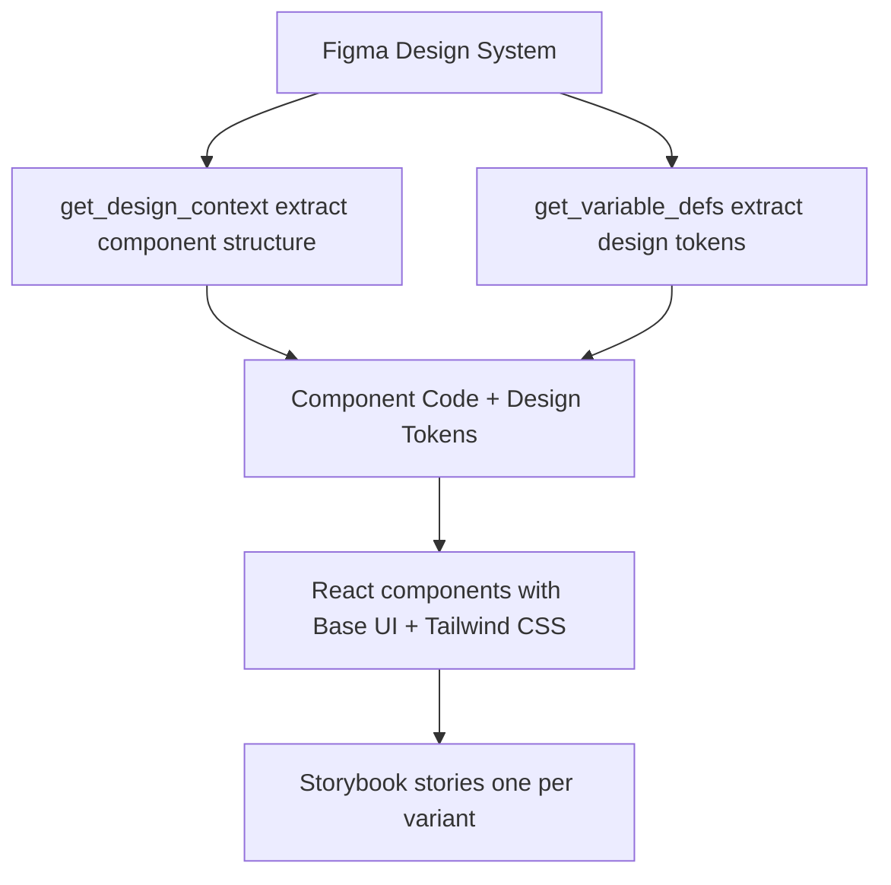
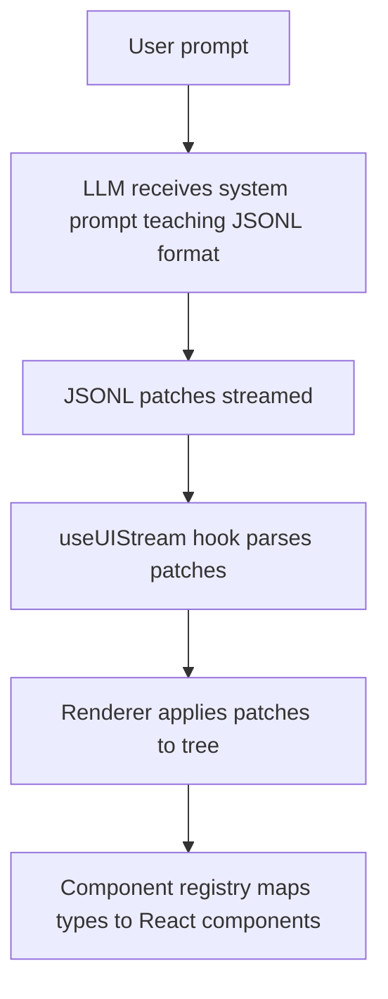

You give a coding agent the same prompt twice. You get two completely different UIs.

That's not a bug, it's just how LLMs work. Non-determinism is baked into these models. Same input, different output. Every time. When you're generating code, this creates a predictability problem: you don't know what you're going to get. One run gives you clean, modular components. The next? A spaghetti mess with a totally different framework approach.

If you've built anything with LLMs, you've felt this. You craft the "perfect" prompt, it works during your demo, then you run it for a customer and it produces something completely different. Not necessarily wrong, just _different_. And in software, different usually means unreliable.

The fix isn't writing "better" prompts. It's adding constraints.

## Constraints are features

When you limit choices, you get predictable results. This works for design systems, code architecture, and AI-generated UIs. Instead of letting the LLM wander through infinite possibilities, give it a small, well-defined map to follow.

I spoke at [FE.OPO #9](https://www.youtube.com/live/omoDqK2kWKU?si=zsB14TzXFnZyJfKe&t=429) about three ways to tame this unpredictability:

1. **Figma MCP (Design System Contracts)**: Turning Figma into a machine-readable source of truth.
2. **agent-browser (Visual Feedback Loops)**: A "Generate → Validate → Iterate" cycle that actually sees what it built.
3. **json-render (Structured Output)**: Swapping free-form code for a strict component catalog.

Let's break down how they work.

## 1. Figma MCP: Design as contract

**The frustration**: The "telephone game" of design handoff.

A designer builds a mockup, a developer interprets the visuals, and somewhere the implementation drifts. Colors are a hex code off. Spacing feels wrong. Typography doesn't quite match. This gap between intent and implementation is where UI quality dies.

**The fix**: Stop interpreting. Start extracting.

Figma MCP (Model Context Protocol) lets an agent read Figma files programmatically. Extract components, design tokens, variants. Generate code that matches design exactly. No interpretation gap.

The workflow:



**Step 1: Extract design tokens**

```typescript
// Use Figma MCP
mcp__figma__get_variable_defs(fileKey, nodeId);

// Generates tokens.ts:

// Design tokens extracted from Figma Simple Design System
// https://www.figma.com/design/dHqyIhebbTxZSzOun8aAaA/Simple-Design-System--Community-
export const tokens = {
  color: {
    text: {
      brandOnBrand: "#f5f5f5",
      default: "#1e1e1e",
      subtle: "#666666",
    },
    background: {
      brandDefault: "#1e1e1e",
      brandHover: "#2d2d2d",
      neutral: "#e5e5e5",
      neutralHover: "#d4d4d4",
      subtle: "transparent",
      subtleHover: "#f5f5f5",
    },
    border: {
      neutral: "#d4d4d4",
      subtle: "#e5e5e5",
    },
  },
  typography: {
    body: {
      fontFamily: "Inter, sans-serif",
      fontWeightRegular: 400,
      sizeMedium: "16px",
      sizeSmall: "14px",
    },
  },
  spacing: {
    xs: "4px",
    sm: "8px",
    md: "12px",
    lg: "16px",
  },
  borderRadius: {
    sm: "4px",
    md: "6px",
  },
} as const;
```

If you are using Tailwind CSS you could easily ask your coding agent to convert this file to Tailwind's V4 CSS configuration:

```css
/* don't worry about the variable names */
/* they are bad, but that's just an example */
@import "tailwindcss";

@theme {
  /* Colors - Text */
  --color-brand-on-brand: #f5f5f5;
  --color-default: #1e1e1e;
  --color-subtle: #666666;
  --color-disabled: #a3a3a3;

  /* Colors - Background */
  --color-bg-brand: #2c2c2c;
  --color-bg-brand-hover: #1e1e1e;
  --color-bg-neutral: #e3e3e3;
  --color-bg-neutral-hover: #cdcdcd;
  --color-bg-subtle-hover: #f5f5f5;
  --color-bg-disabled: #e5e5e5;

  /* Colors - Border */
  --color-border-primary: #2c2c2c;
  --color-border-neutral: #767676;
  --color-border-subtle: #d9d9d9;
  --color-border-disabled: #b3b3b3;

  /* Typography */
  --font-body: "Inter", sans-serif;

  /* Border Radius */
  --radius-md: 8px;

  /* Spacing */
  --spacing-sm: 8px;
  --spacing-md: 12px;
}
```

These become your single source of truth. Change Figma variable, re-extract, update tokens.ts. Design stays in sync with code.

**Step 2: Extract component structure**

```typescript
// Extract Button component
mcp__figma__get_design_context(fileKey, buttonNodeId);
```

```tsx
// Returns React component code with Base UI + Tailwind CSS:
import * as React from "react";
import { Button as BaseButton } from "@base-ui/react/button";
import { cva, type VariantProps } from "class-variance-authority";

export interface ButtonProps
  extends
    Omit<React.ComponentPropsWithoutRef<typeof BaseButton>, "disabled">,
    VariantProps<typeof buttonVariants> {}

const buttonVariants = cva(
  "inline-flex items-center justify-center gap-2 border font-body font-normal leading-none rounded-md transition-colors",
  {
    variants: {
      variant: {
        primary: "bg-bg-brand text-brand-on-brand",
        neutral: "bg-bg-neutral text-default",
        subtle: "bg-transparent text-default border-transparent",
      },
      size: {
        small: "h-8 p-sm text-sm",
        medium: "h-10 p-md text-base",
      },
      disabled: {
        false: null,
        true: "bg-bg-disabled text-disabled cursor-not-allowed border-border-disabled",
      },
    },
    compoundVariants: [
      {
        variant: "primary",
        disabled: false,
        className: "border-border-primary hover:bg-bg-brand-hover",
      },
      {
        variant: "neutral",
        disabled: false,
        className: "border-border-neutral hover:bg-bg-neutral-hover",
      },
      {
        variant: "subtle",
        disabled: false,
        className: "hover:border-border-subtle",
      },
    ],
    defaultVariants: {
      variant: "primary",
      size: "medium",
      disabled: false,
    },
  },
);

export function Button({
  className,
  variant,
  size,
  children,
  disabled,
  ...props
}: ButtonProps) {
  return (
    <BaseButton
      className={buttonVariants({ variant, size, disabled, className })}
      disabled={disabled || undefined}
      {...props}
    >
      {children}
    </BaseButton>
  );
}
```

For a Button component with 18 variants (3 visual styles × 3 states × 2 sizes), Figma MCP extracts all of them and maps to accessible primitives like Base UI.

**Step 3: Generate Storybook stories**

For each Figma variant, generate a Storybook story:

```typescript
// examples/design-system-demo/src/components/button.stories.tsx
export const PrimaryDefaultMedium: Story = {
  args: {
    variant: "primary",
    size: "medium",
    children: "Button",
  },
};

export const PrimaryHoverMedium: Story = {
  args: {
    variant: "primary",
    size: "medium",
    children: "Button",
  },
  parameters: {
    pseudo: { hover: true },
  },
};

export const PrimaryDisabledMedium: Story = {
  args: {
    variant: "primary",
    size: "medium",
    children: "Button",
    disabled: true,
  },
};

// ...15 more variants
```

Storybook becomes documentation that matches Figma exactly. Designers and developers reference the same source.

**Why this works**:

- Design tokens aren't scattered across Slack messages and CSS files. They live in Figma and sync to code.
- Stop hand-coding 18 button variants. Let the machine do the grunt work.
- When a designer changes "Primary Blue," the code updates automatically.
- You can compare a screenshot of the code against the original Figma node to verify they match.

**When to use it**: You have a solid design system in Figma. You're building a component library. The gap between design and dev is causing friction.

**When to skip it**: You don't have a design system yet. Your designs are changing so fast that extraction becomes a bottleneck.

The power is in the constraint. Figma becomes the boss. You're not guessing, you're following a contract.

## 2. Visual feedback loops: Giving the AI eyes

**The blind spot**: LLMs reason about code well, but they're blind to how that code actually _looks_.

An LLM knows `justify-center` should center an item. It understands a footer belongs at the bottom. But it has no idea about browser quirks, z-index collisions, or parent container constraints. It's writing code into a void.

We've all seen it:

- **Prompt**: "Center the login form."
- **Code**: Looks perfect on paper.
- **Reality**: Shoved into the top-left corner because of a CSS reset it didn't see coming.

**The fix**: A "Generate → Validate → Iterate" loop.

Build a feedback loop: the LLM generates code, you (or a tool) validate the rendered output, then feed results back for iteration. The constraint is forcing validation before considering work done.

Two tools enable this: **agent-browser** (natural language) and **Playwright MCP** (screenshots). Different tradeoffs.

A login form I built for the demo:

```tsx
// examples/feedback-loop-demo/app/page.tsx
export default function Page() {
  return (
    <main className="flex min-h-screen items-center justify-center p-8">
      <div className="w-full max-w-md">
        <div className="rounded-lg bg-white p-8 shadow-lg">
          <h1 className="mb-2 text-2xl font-bold text-gray-900">
            Welcome back
          </h1>
          <p className="mb-6 text-gray-600">
            Sign in to your account to continue
          </p>

          <form onSubmit={handleSubmit} className="space-y-4">
            <div>
              <label
                htmlFor="email"
                className="mb-1 block text-sm font-medium text-gray-700"
              >
                Email
              </label>
              <input
                id="email"
                type="email"
                required
                className="w-full rounded-md border border-gray-300 px-3 py-2 focus:ring-2 focus:ring-blue-500 focus:outline-none"
              />
            </div>
            {/* password, checkbox, button... */}
          </form>
        </div>
      </div>
    </main>
  );
}
```

To validate with **agent-browser**:

```bash
# Navigate and get snapshot
Navigate to http://localhost:3001 and validate the login form layout.
Check if email input, password input, and submit button are all visible
and properly aligned.
```

agent-browser returns natural language:

```
* Page loaded successfully
* Login form card visible at center
* Email input: visible, properly labeled, placeholder present
* Password input: visible, properly labeled, placeholder present
* Submit button: visible, blue background, prominent
* Visual hierarchy: excellent (title → inputs → button → footer)
* Accessibility: labels properly associated with inputs
! Minor: "Forgot password" link small, could be more prominent

Overall: Form displays correctly with good UX
```

This output validates all key elements, identifies an improvement opportunity, and uses ~500 bytes vs ~50KB for screenshots. That means 100+ iterations within a typical context window.

Compare to **Playwright MCP**:

```typescript
// Would require:
mcp__playwright__browser_navigate({ url: "http://localhost:3001" });
mcp__playwright__browser_snapshot({ filename: "login-form.md" });
mcp__playwright__browser_take_screenshot({ filename: "login-form.png" });
```

Returns full page snapshot (markdown + accessibility tree) plus base64 PNG screenshot. ~50KB+ added to context window per screenshot.

Context budget comparison:

| Aspect          | agent-browser       | Playwright MCP           |
| --------------- | ------------------- | ------------------------ |
| Output format   | Natural language    | Markdown + base64 images |
| Context impact  | Low (~1KB)          | High (~50KB+)            |
| Use case        | Quick visual checks | Deep inspection          |
| Iteration speed | Fast (text-based)   | Slower (image-heavy)     |
| Precision       | Semantic validation | Pixel-perfect validation |

**When to use agent-browser**: Validating layout, positioning, or basic visibility. Iterating fast. Watching your context window budget.

**When to use Playwright MCP**: Pixel-perfect comparisons. Complex multi-step user flows. Screenshots for documentation or regression testing.

The workflow: Generate → Render → Validate → Fix. Forcing the AI to "look" at its work before moving on kills 90% of visual bugs that haunt AI-generated UIs.

For agentic workflows where an agent iterates autonomously, agent-browser preserves context budget for code changes instead of bloating it with images.

## 3. json-render: UI as data

**The chaos**: Free-form code generation is a wild west.

Even within the same framework, naming conventions and component structures shift every time you hit "Regenerate."

**The fix**: Stop asking for code. Ask for data.

json-render implements this pattern: AI → JSONL → UI. Instead of asking the LLM to output React/Vue/whatever directly, you teach it to output JSON Lines patches describing the UI structure. A separate renderer applies those patches and maps them to your component library.

The architecture:



The key constraint is the **component catalog**. You define available components upfront with Zod schemas:

```typescript
export const catalog = createCatalog({
  components: {
    Card: {
      props: z.object({
        title: z.string(),
        description: z.string().nullable(),
      }),
      hasChildren: true,
    },
    Button: {
      props: z.object({
        label: z.string(),
        action: z.string(),
        params: z.record(z.string(), z.any()).optional(),
        variant: z.enum(["default", "outline", "ghost"]).optional(),
        size: z.enum(["default", "sm", "lg"]).optional(),
      }),
    },
    Text: {
      props: z.object({
        content: z.string(),
      }),
    },
  },
  actions: {
    submit: {
      params: z.object({ formId: z.string() }),
    },
    navigate: {
      params: z.object({ url: z.string() }),
    },
  },
});
```

This catalog serves two purposes:

1. Generates the system prompt teaching the LLM the JSONL format
2. Validates runtime props via `@json-render/core`

The system prompt becomes your contract:

```typescript
const SYSTEM_PROMPT = `You are a UI generator that outputs JSONL (JSON Lines) patches.

AVAILABLE COMPONENTS:
Card, Button, Text

COMPONENT DETAILS:
- Card: { title: string, description?: string | null } - Container with title, can have children
- Button: { label: string, action: string, params?: object, variant?: "default" | "outline" | "ghost", size?: "default" | "sm" | "lg" } - Clickable button that triggers an action
- Text: { content: string } - Text paragraph

OUTPUT FORMAT:
Output JSONL where each line is a patch operation. Use a FLAT key-based structure:

OPERATIONS:
- {"op":"set","path":"/root","value":"main-card"} - Set the root element key
- {"op":"add","path":"/elements/main-card","value":{...}} - Add an element by unique key

ELEMENT STRUCTURE:
{
  "key": "unique-key",
  "type": "ComponentType",
  "props": { ... },
  "children": ["child-key-1", "child-key-2"]  // Array of child element keys (only for Card)
}

RULES:
1. First set /root to the root element's key
2. Add each element with a unique key using /elements/{key}
3. Parent elements list child keys in their "children" array
4. Stream elements progressively - parent first, then children
5. Each element must have: key, type, props
6. Children array contains STRING KEYS, not nested objects
7. Only Card can have children

Generate JSONL patches now:`;
```

Notice the constraints:

- Only 3 components (Card, Button, Text)
- Flat key-based structure (no nesting)
- Only Card supports children
- Children are string keys, not objects
- Specific operations (set, add)

When you prompt "Create a welcome card with a button," the model generates:

```jsonl
{"op":"set","path":"/root","value":"welcome-card"}
{"op":"add","path":"/elements/welcome-card","value":{"key":"welcome-card","type":"Card","props":{"title":"Welcome","description":"Thanks for trying json-render"},"children":["greeting-text","get-started-btn"]}}
{"op":"add","path":"/elements/greeting-text","value":{"key":"greeting-text","type":"Text","props":{"content":"This demo shows how AI can generate predictable UIs using structured output formats."}}}
{"op":"add","path":"/elements/get-started-btn","value":{"key":"get-started-btn","type":"Button","props":{"label":"Get Started","action":"navigate","params":{"url":"/home"},"variant":"default"}}}
```

These patches stream to the frontend. The `useUIStream` hook parses them. The `Renderer` component applies them to a tree structure. Finally, the component registry maps types to React implementations:

```tsx
export const registry: ComponentRegistry = {
  Card: ({ element, children }) => (
    <article className="max-w-xs rounded-md border-2 border-gray-500 bg-gray-800 p-4 text-gray-100 shadow">
      <header>
        <h2 className="text-xl font-bold">{element.props.title}</h2>
        {element.props.description && (
          <p className="text-gray-400">{element.props.description}</p>
        )}
      </header>
      <div className="space-y-4 pt-8">{children}</div>
    </article>
  ),
  Button,
  Text: ({ element }) => <p>{element.props.content}</p>,
};
```

**Why this works**: The LLM _cannot_ deviate. It knows it has exactly three components. It knows what props they take. It has a strict recipe to follow. Limited choices, predictable results.

**When to use json-render**: You have a set component library and want the AI to assemble UIs. You want progressive streaming. You need to validate output at runtime before it hits the user.

**When to skip it**: You need total design freedom (custom landing pages). Your layout has deep nesting that's hard to represent flat. Your component library is constantly changing.

The catalog is your design contract. Change it, regenerate the system prompt, done.

## Which one should you use?

These aren't competing tools. They're different layers of the same stack.

- **Figma MCP**: Your design system is law. You need 1:1 match with Figma files.
- **agent-browser**: Speed and cost matter. The AI gets "semantic vision" to fix its own mistakes without burning context on screenshots.
- **json-render**: You need absolute consistency. Dashboards or internal tools where the AI assembles pre-approved building blocks.

**Watch your context budget.** If the agent is iterating autonomously, every byte counts.

- agent-browser (~1KB) beats Playwright screenshots (~50KB)
- json-render patches (~2KB) beat full code generation (~20KB)

The more expensive your feedback, the fewer chances the AI gets to iterate.

## The bottom line

Same prompt, different outputs. That's how LLMs work. Constraints change the game.

Design contracts (Figma MCP), feedback loops (agent-browser), and structured output (json-render) turn a chaotic generator into something predictable.

These aren't silver bullets. Figma MCP has rate limits. agent-browser won't catch every pixel-perfect glitch. json-render isn't built for infinite design freedom.

But guardrails work. When you constrain the problem space and make choices finite, you get code you can trust.

Predictability through constraints. Not despite them.

---

All code from this post is available at [ubmit/from-prompts-to-predictable-user-interfaces](https://github.com/ubmit/from-prompts-to-predictable-user-interfaces). Slides, demos, and full examples are all there.
