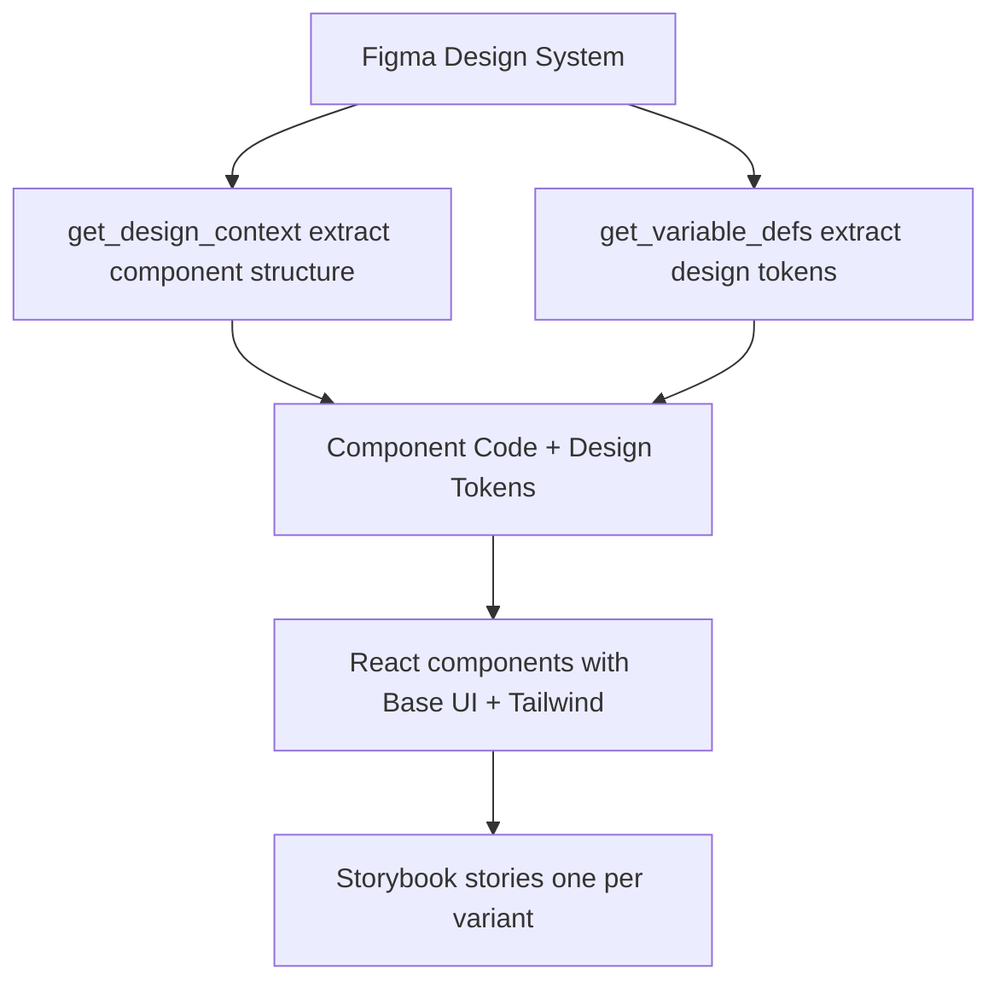
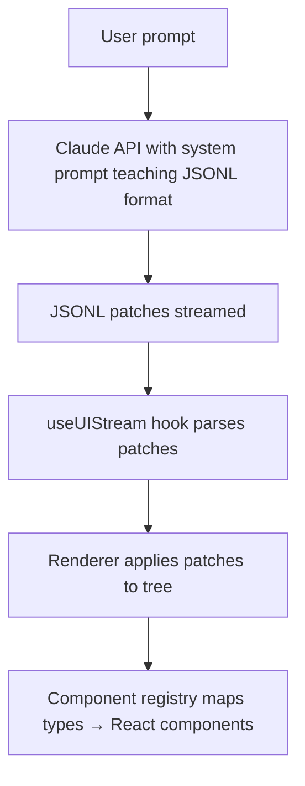

You give Claude the same prompt twice. You get two completely different UIs.

That's not a bug—it's just how LLMs work. Non-determinism is baked into the core of these models. Same input, different output. Every single time. When you're generating code, this creates a massive predictability problem: you simply don't know what you're going to get. One run gives you clean, modular components. The next? A spaghetti mess with a totally different framework approach.

If you’ve built anything with LLMs, you’ve felt this. You craft the "perfect" prompt, it works beautifully during your demo, and then you run it for a customer only for it to produce something completely unexpected. It’s not necessarily "wrong," it’s just _different_. And in software, "different" is usually the enemy of reliable.

The fix isn’t writing "better" prompts. It’s adding constraints.

## Constraints Are a Feature, Not a Bug

When you limit choices, you get predictable results. This is the secret sauce for design systems, code architecture, and—most importantly—AI-generated UIs. Instead of letting the LLM wander through infinite possibilities, we give it a small, high-quality map to follow.

I recently spoke at FE.OPO #9 about three ways to tame this unpredictability:

1.  **Figma MCP (Design System Contracts)**: Turning Figma into a machine-readable source of truth.
2.  **agent-browser (Visual Feedback Loops)**: A "Generate → Validate → Iterate" cycle that actually sees what it built.
3.  **json-render (Structured Output)**: Swapping free-form code for a strict component catalog.

Let’s break down how they work.

## 1. Figma MCP: Design as the Ultimate Contract

**The frustration**: The "telephone game" of design handoff.

A designer builds a beautiful mockup, a developer interprets those visuals, and somewhere along the way, the implementation starts to drift. Colors are a hex code off. Spacing feels "weird." Typography doesn't quite match. This gap—the distance between intent and implementation—is where UI quality goes to die.

**The fix**: Stop interpreting. Start extracting.

Figma MCP (Model Context Protocol) lets Claude read Figma files programmatically. Extract components, design tokens, variants—everything. Generate code that matches design exactly. No interpretation gap.

Here's the workflow:



**Step 1: Extract design tokens**

```typescript
// Use Figma MCP
mcp__figma__get_variable_defs(fileKey, nodeId);

// Generates tokens.ts:
export const tokens = {
  color: {
    text: {
      brandOnBrand: "#f5f5f5",
      default: "#1e1e1e",
      subtle: "#666666",
    },
    background: {
      brandDefault: "#1e1e1e",
      brandHover: "#2d2d2d",
      neutral: "#e5e5e5",
      neutralHover: "#d4d4d4",
      subtle: "transparent",
      subtleHover: "#f5f5f5",
    },
    border: {
      neutral: "#d4d4d4",
      subtle: "#e5e5e5",
    },
  },
  typography: {
    body: {
      fontFamily: "Inter, sans-serif",
      fontWeightRegular: 400,
      sizeMedium: "16px",
      sizeSmall: "14px",
    },
  },
  spacing: {
    xs: "4px",
    sm: "8px",
    md: "12px",
    lg: "16px",
  },
  borderRadius: {
    sm: "4px",
    md: "6px",
  },
} as const;
```

These become your single source of truth. Change Figma variable, re-extract, update tokens.ts. Design stays in sync with code.

**Step 2: Extract component structure**

```typescript
// Extract Button component
mcp__figma__get_design_context(fileKey, buttonNodeId);

// Returns React component code with Tailwind
```

For a Button component with 18 variants (3 visual styles × 3 states × 2 sizes), Figma MCP extracts all of them. You map to accessible primitives:

```typescript
// examples/design-system-demo/src/components/button.tsx
import { Button as BaseButton } from "@base-ui/react/button";
import { cva, type VariantProps } from "class-variance-authority";

const buttonVariants = cva(
  "inline-flex items-center justify-center gap-2 border font-body font-normal leading-none rounded-md transition-colors",
  {
    variants: {
      variant: {
        primary: "bg-bg-brand text-brand-on-brand",
        neutral: "bg-bg-neutral text-default",
        subtle: "bg-transparent text-default border-transparent",
      },
      size: {
        small: "h-8 p-sm text-sm",
        medium: "h-10 p-md text-base",
      },
      disabled: {
        false: null,
        true: "bg-bg-disabled text-disabled cursor-not-allowed border-border-disabled",
      },
    },
    compoundVariants: [
      {
        variant: "primary",
        disabled: false,
        className: "border-border-primary hover:bg-bg-brand-hover",
      },
      {
        variant: "neutral",
        disabled: false,
        className: "border-border-neutral hover:bg-bg-neutral-hover",
      },
      {
        variant: "subtle",
        disabled: false,
        className: "hover:border-border-subtle",
      },
    ],
    defaultVariants: {
      variant: "primary",
      size: "medium",
      disabled: false,
    },
  },
);

export function Button({ className, variant, size, children, disabled, ...props }: ButtonProps) {
  return (
    <BaseButton
      className={buttonVariants({ variant, size, disabled, className })}
      disabled={disabled || undefined}
      {...props}
    >
      {children}
    </BaseButton>
  );
}
```

**Step 3: Generate Storybook stories**

For each Figma variant, generate a Storybook story:

```typescript
// examples/design-system-demo/src/components/button.stories.tsx
export const PrimaryDefaultMedium: Story = {
  args: {
    variant: "primary",
    size: "medium",
    children: "Button",
  },
};

export const PrimaryHoverMedium: Story = {
  args: {
    variant: "primary",
    size: "medium",
    children: "Button",
  },
  parameters: {
    pseudo: { hover: true },
  },
};

export const PrimaryDisabledMedium: Story = {
  args: {
    variant: "primary",
    size: "medium",
    children: "Button",
    disabled: true,
  },
};

// ...15 more variants
```

Storybook becomes living documentation that matches Figma exactly. Designers and developers reference the same truth.

**Why this is a game-changer**:

- **One source of truth**: Design tokens aren't scattered across Slack messages and CSS files—they live in Figma and sync to code.
- **No more manual mapping**: Stop hand-coding 18 different button variants. Let the machine do the grunt work.
- **Sync by default**: When a designer changes a "Primary Blue," the code updates automatically. No "oops, I forgot to update the hex code" moments.
- **Visual proof**: You can actually compare a screenshot of the code against the original Figma node to ensure they’re identical.

**When to reach for it**:

- You already have a solid design system in Figma.
- You’re building a component library from scratch.
- The "gap" between design and dev is causing real friction.

**When to skip it**:

- You don't have a design system yet (don't over-engineer a mess).
- Your designs are changing so fast that the extraction becomes a bottleneck.

The real power here is the constraint. By making Figma the "boss," you aren't just guessing—you're following a contract. Predictability doesn't come from luck; it comes from authority.

## 2. Visual Feedback Loops: Giving the AI Eyes

**The blind spot**: LLMs are great at reasoning about code, but they’re completely blind to how that code actually _looks_.

An LLM knows that `justify-center` should center an item. It understands that a footer belongs at the bottom. But it has no idea about browser quirks, z-index collisions, or parent container constraints. It’s writing code into a void.

We’ve all seen it:

- **Prompt**: "Center the login form."
- **Code**: Looks perfect on paper.
- **Reality**: It’s shoved into the top-left corner because of a CSS reset it didn't see coming.

**The fix**: A "Generate → Validate → Iterate" loop.

Build a feedback loop where the LLM generates code, you (or a tool) validate the rendered output, then feed results back for iteration. The constraint here is forcing validation before considering work "done."

Two tools enable this: **agent-browser** (natural language) and **Playwright MCP** (screenshots). Different tradeoffs.

Here's a login form I built for the demo:

```typescript
// examples/feedback-loop-demo/app/page.tsx
export default function Page() {
  return (
    <main className="flex min-h-screen items-center justify-center p-8">
      <div className="w-full max-w-md">
        <div className="bg-white rounded-lg shadow-lg p-8">
          <h1 className="text-2xl font-bold text-gray-900 mb-2">
            Welcome back
          </h1>
          <p className="text-gray-600 mb-6">
            Sign in to your account to continue
          </p>

          <form onSubmit={handleSubmit} className="space-y-4">
            <div>
              <label htmlFor="email" className="block text-sm font-medium text-gray-700 mb-1">
                Email
              </label>
              <input
                id="email"
                type="email"
                required
                className="w-full px-3 py-2 border border-gray-300 rounded-md focus:outline-none focus:ring-2 focus:ring-blue-500"
              />
            </div>
            {/* password, checkbox, button... */}
          </form>
        </div>
      </div>
    </main>
  );
}
```

To validate with **agent-browser**:

```bash
# Navigate and get snapshot
Navigate to http://localhost:3001 and validate the login form layout.
Check if email input, password input, and submit button are all visible
and properly aligned.
```

agent-browser returns natural language:

```
* Page loaded successfully
* Login form card visible at center
* Email input: visible, properly labeled, placeholder present
* Password input: visible, properly labeled, placeholder present
* Submit button: visible, blue background, prominent
* Visual hierarchy: excellent (title → inputs → button → footer)
* Accessibility: labels properly associated with inputs
! Minor: "Forgot password" link small, could be more prominent

Overall: Form displays correctly with good UX
```

This output:

- Validates all key elements
- Identifies improvement opportunity
- Uses ~500 bytes vs ~50KB for screenshots
- Enables 100+ iterations within typical context window

Compare to **Playwright MCP**:

```typescript
// Would require:
mcp__playwright__browser_navigate({ url: "http://localhost:3001" });
mcp__playwright__browser_snapshot({ filename: "login-form.md" });
mcp__playwright__browser_take_screenshot({ filename: "login-form.png" });
```

Returns full page snapshot (markdown + accessibility tree) plus base64 PNG screenshot. ~50KB+ added to context window per screenshot.

**Context budget comparison:**

| Aspect          | agent-browser       | Playwright MCP           |
| --------------- | ------------------- | ------------------------ |
| Output format   | Natural language    | Markdown + base64 images |
| Context impact  | Low (~1KB)          | High (~50KB+)            |
| Use case        | Quick visual checks | Deep inspection          |
| Iteration speed | Fast (text-based)   | Slower (image-heavy)     |
| Precision       | Semantic validation | Pixel-perfect validation |

**When to use agent-browser**:

- You need to validate layout, positioning, or basic visibility.
- You’re iterating fast and don't want to wait for heavy images to upload.
- You’re worried about blowing your context window budget.

**When to use Playwright MCP**:

- You need pixel-perfect comparisons.
- You’re testing a complex, multi-step user flow.
- You need actual screenshots for documentation or regression testing.

The workflow is simple: Generate → Render → Validate → Fix. By forcing the AI to "look" at its work before it moves on, you kill off 90% of the visual bugs that usually haunt AI-generated UIs.

For agentic workflows where Claude is autonomously iterating on designs, agent-browser preserves context budget for actual code changes instead of bloating it with images.

## 3. json-render: UI as Data, Not Just Code

**The chaos**: Free-form code generation is a wild west.

Ask an LLM to "build a login form" and it might give you React today, Vue tomorrow, and a custom CSS-in-JS solution the day after. Even within the same framework, the naming conventions and component structures will shift every time you hit "Regenerate."

**The fix**: Stop asking for code. Start asking for data.

json-render is a library that implements this pattern: AI → JSONL → UI. Instead of asking the LLM to output React/Vue/whatever directly, you teach it to output JSON Lines patches describing the UI structure. A separate renderer applies those patches and maps them to your component library.

Here's the architecture:



The key constraint is the **component catalog**. You define available components upfront with Zod schemas:

```typescript
export const catalog = createCatalog({
  components: {
    Card: {
      props: z.object({
        title: z.string(),
        description: z.string().nullable(),
      }),
      hasChildren: true,
    },
    Button: {
      props: z.object({
        label: z.string(),
        action: z.string(),
        params: z.record(z.string(), z.any()).optional(),
        variant: z.enum(["default", "outline", "ghost"]).optional(),
        size: z.enum(["default", "sm", "lg"]).optional(),
      }),
    },
    Text: {
      props: z.object({
        content: z.string(),
      }),
    },
  },
  actions: {
    submit: {
      params: z.object({ formId: z.string() }),
    },
    navigate: {
      params: z.object({ url: z.string() }),
    },
  },
});
```

This catalog serves two purposes:

1. Generates the system prompt teaching Claude the JSONL format
2. Validates runtime props via `@json-render/core`

The system prompt becomes your contract:

```typescript
const SYSTEM_PROMPT = `You are a UI generator that outputs JSONL (JSON Lines) patches.

AVAILABLE COMPONENTS:
Card, Button, Text

COMPONENT DETAILS:
- Card: { title: string, description?: string | null } - Container with title, can have children
- Button: { label: string, action: string, params?: object, variant?: "default" | "outline" | "ghost", size?: "default" | "sm" | "lg" } - Clickable button that triggers an action
- Text: { content: string } - Text paragraph

OUTPUT FORMAT:
Output JSONL where each line is a patch operation. Use a FLAT key-based structure:

OPERATIONS:
- {"op":"set","path":"/root","value":"main-card"} - Set the root element key
- {"op":"add","path":"/elements/main-card","value":{...}} - Add an element by unique key

ELEMENT STRUCTURE:
{
  "key": "unique-key",
  "type": "ComponentType",
  "props": { ... },
  "children": ["child-key-1", "child-key-2"]  // Array of child element keys (only for Card)
}

RULES:
1. First set /root to the root element's key
2. Add each element with a unique key using /elements/{key}
3. Parent elements list child keys in their "children" array
4. Stream elements progressively - parent first, then children
5. Each element must have: key, type, props
6. Children array contains STRING KEYS, not nested objects
7. Only Card can have children

Generate JSONL patches now:`;
```

Notice the constraints:

- Only 3 components (Card, Button, Text)
- Flat key-based structure (no nesting)
- Only Card supports children
- Children are string keys, not objects
- Specific operations (set, add)

When you prompt "Create a welcome card with a button," Claude generates:

```jsonl
{"op":"set","path":"/root","value":"welcome-card"}
{"op":"add","path":"/elements/welcome-card","value":{"key":"welcome-card","type":"Card","props":{"title":"Welcome","description":"Thanks for trying json-render"},"children":["greeting-text","get-started-btn"]}}
{"op":"add","path":"/elements/greeting-text","value":{"key":"greeting-text","type":"Text","props":{"content":"This demo shows how AI can generate predictable UIs using structured output formats."}}}
{"op":"add","path":"/elements/get-started-btn","value":{"key":"get-started-btn","type":"Button","props":{"label":"Get Started","action":"navigate","params":{"url":"/home"},"variant":"default"}}}
```

These patches stream to the frontend. The `useUIStream` hook parses them. The `Renderer` component applies them to a tree structure. Finally, the component registry maps types to React implementations:

```typescript
export const registry: ComponentRegistry = {
  Card: ({ element, children }) => (
    <article className="p-4 border-2 border-gray-500 rounded-md max-w-xs shadow bg-gray-800 text-gray-100">
      <header>
        <h2 className="font-bold text-xl">{element.props.title}</h2>
        {element.props.description && (
          <p className="text-gray-400">{element.props.description}</p>
        )}
      </header>
      <div className="space-y-4 pt-8">{children}</div>
    </article>
  ),
  Button,
  Text: ({ element }) => <p>{element.props.content}</p>,
};
```

**Why this is a win**: The LLM literally _cannot_ deviate. It knows it has exactly three components. It knows exactly what props they take. It has a strict recipe to follow. Limited choices lead to predictable results, every single time.

**When to use json-render**:

- You have a set component library and want the AI to just "assemble" UIs.
- You want that cool, progressive "streaming" UI effect.
- You need to validate the AI's output at runtime before it hits the user.

**When to skip it**:

- You need total design freedom (e.g., custom landing pages).
- Your layout has deep, complex nesting that's hard to represent in a flat list.
- Your component library is constantly in flux.

The catalog becomes your design contract. Change it, regenerate the system prompt, done. Predictability through constraints.

## Which One Should You Use?

These aren't competing tools; they’re different layers of the same stack.

- **Figma MCP** is for when your design system is the law. If you need your generated UI to be a 1:1 match with your Figma files, this is your tool.
- **agent-browser** is for when speed and cost matter. It gives the AI "semantic vision" so it can fix its own mistakes without burning through your context window with massive screenshots.
- **json-render** is for when you need absolute consistency. It’s perfect for dashboards or internal tools where you want the AI to assemble pre-approved building blocks rather than inventing new ones.

**Pro-tip: Watch your context budget.** If you’re building agentic workflows where Claude is iterating autonomously, every byte counts.

- **agent-browser** (~1KB) wins over **Playwright screenshots** (~50KB).
- **json-render patches** (~2KB) win over **full code generation** (~20KB).

The more "expensive" your feedback is, the fewer chances the AI has to get it right.

## The Bottom Line

Same prompt, different outputs—that's the nature of LLMs. But constraints change the game.

By using **design contracts** (Figma MCP), **feedback loops** (agent-browser), and **structured output** (json-render), you can turn a chaotic generator into a predictable engine.

These aren't silver bullets. Figma MCP has rate limits. agent-browser won't catch every pixel-perfect glitch. json-render isn't built for infinite design freedom.

But they all share one big truth: **guardrails are your best friend**. When you constrain the problem space and make choices finite, you don't just get better code—you get code you can actually trust.

Predictability through constraints. Not despite them.

---

All code from this post available at [ubmit/from-prompts-to-predictable-user-interfaces](https://github.com/ubmit/from-prompts-to-predictable-user-interfaces). Slides, demos, and full examples are all there.
